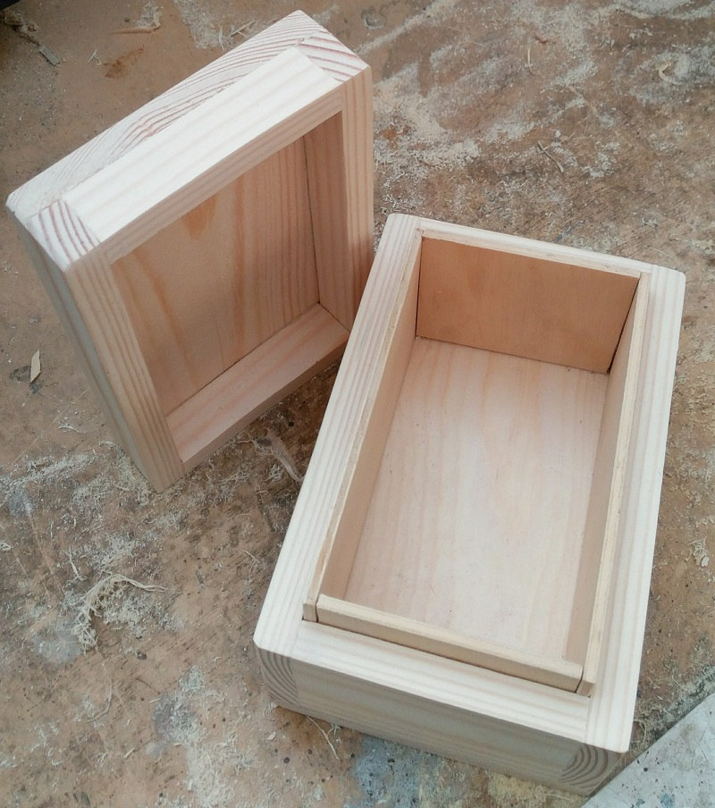

## Turning a block into a box

Once the glue is dry, sand your block all over, ensuring that the ends are flat and smooth. Add a small bevel to the edges of the box to make it more pleasant to handle.

With a square and a ruler draw a straight line all the way around the box about two thirds of the way up the side. Then, carefully saw along that line to separate the lid from the box. Sand away the saw marks, but try not to sand too much. Keep checking that your two halves still match nicely.

The last assembly step for the box is to add the lining. This is made from 3 mm ply. Cut this to size so that about 10mm protrudes above the base of the box. Ensure that all of your pieces are the same size and don’t forget to allow for the thickness when measuring. Finally, you can finish the box with varnish or Danish oil to give your box protection from the elements and to show off the grain. Two or three coats is recommended.

Once the varnish is dry, drill a hole in the front on one side for the coach bolt. Thread the bolt into the hole and add a washer. Tighten with a nut so that the square part of the coach pulls tightly into the wood. Now remove the nut.

Drill a hole in the middle of the sensor pad. Thread this onto the bolt, followed by the second washer. Finally, add a nut to secure. You can test the sensor works using the battery pack and a multimeter to see the output voltage.

--- collapse ---
---
title: Surform
---

I like to use a tool called a Surform, which looks like a small cheese grater. This is good at removing wood a bit faster than sanding alone and can be used to quickly get the wood to the correct size. Take care with the ends as you might cause the wood to splinter or ‘break out’.
--- /collapse ---

