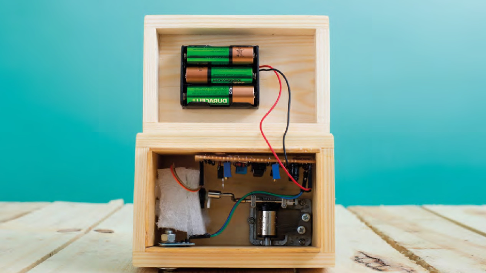

## Putting it all together

When building the stripboard, you can design using squared or lined paper and pencil. It is also possible to use an electronics CAD package such as KiCAD to design your board.

Cut the tracks as per the diagram, remembering that their positions will be flipped when you turn the board over. Solder the wires and small components first, along with the DIL socket. Then add the taller capacitors followed by the transistors. It is usually worth using connectors to attach any external components such as the battery pack, sensor, and motor.

Position the music mechanism and servo in the base of the box. Ensure there is space for the servo arm, and the music mechanism handle can rotate without hitting the sides of the box. Secure the music mechanism with screws.

The motor needs to be at the right height and position so the output shaft aligns with the axis of the music mechanism handle. Cut a rectangle in the foam to fit the servo. Secure the foam into the box using hot glue.

Test that the sensor activates the motor. Adjust the duration and speed trim pots so that the music will play at a suitable pace. You can now enjoy your music box.

